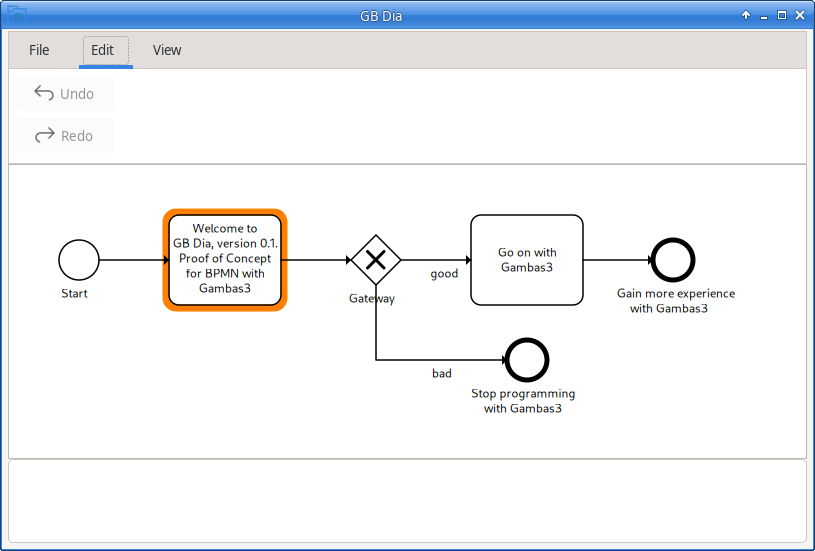

# GB-Dia
GB-Dia is a Gambas based diagram creation program for GNU/Linux, and released under the GPL license. It is inspited by the BPMN 2.0 specification, but tries to be open for numerous extensions.

## Version 0.1
The development goals for this version were:
* Error-free reading and display of the files https://github.com/bpmn-miwg/bpmn-miwg-test-suite/tree/master/Reference **A.1.0.bpmn** and **A.2.0.bpmn** from the BPMN test suite
* Undo-Redo function
* Print function
* In-place text editing function

The overall goal was to test the Gambas3 development environment (version 3.19.1) and the BASIC dialect to see whether
* a GUI application can be developed effectively (look & feel of the interface / available GUI toolkit)
* large applications can be developed effectively (good documentation, finding a solution quickly, good structuring of the source code, modularization),
* good graphics support is available (well-known 2D or 3D engine such as Cairo/OpenGL/SDL, double buffering, ...)
* good printing support is available
* installation packages for different Linux distributions can be easily created

With two exception, all questions can be answered with a convincing YES:
* The source code editor suffers somewhat from the fact that the font size is not adjustable and code folding is not available and
* there are `public` and `private` keywords, but `protected` is missing.
